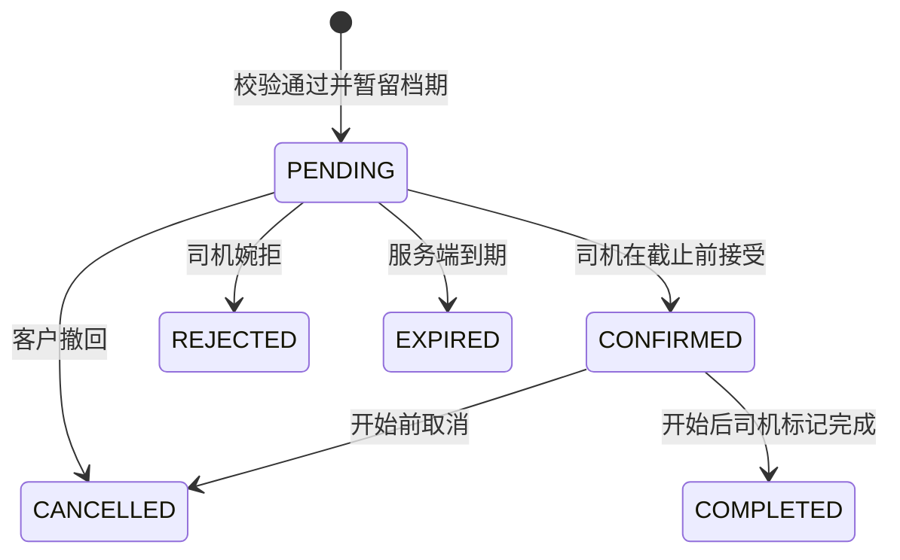

# 私驾约 · MVP 产品需求文档

版本：v0.1 · 2026-09-13  
状态：产品设计稿，可评审；不代表已上线功能。  
依据：恢复的《商务用车小程序方案》对话。产品名称暂定。

## 1. 产品目标与边界

帮助客人管理自己认可的私人司机，查看指定时段是否可约并发起预约；帮助司机管理熟客与时间，减少逐个微信问档期的沟通。关系来自线下相识或既有合作，由司机邀请、客户主动接受。

一个微信小程序支持客户与司机双身份。一个客户可关联多位司机，一个司机可关联多位客户。每位司机在 MVP 中维护一辆当前服务车辆；司机本人是排期资源，不能同时执行两笔预约。客户端没有公开司机目录。

核心闭环：司机邀请 → 客户接受 → 客户选时间与时长 → 从自己的司机中选择 → 发起预约 → 司机确认 → 双方查看同一预约 → 行程完成。

### 本版必须包含

| 优先级 | 能力 | 完成标准 |
|---|---|---|
| P0 | 身份与基本资料 | 客户可用；司机完成资料、车辆与工作时间设置后开放预约 |
| P0 | 私人关系 | 邀请、接受、重复添加去重、失效邀请、解除关系 |
| P0 | 查询忙闲 | 输入起止时间，返回关联司机可约、确认中、不可约状态 |
| P0 | 单司机预约 | 提交、待确认、接受、拒绝、撤回、超时、取消、完成 |
| P0 | 司机排期 | 日程、工作时段、周休、手动占用及删除、预约缓冲 |
| P0 | 我的预约/客户 | 双方查看自己的记录；司机私有备注；客户常用司机标记 |
| P0 | 状态通知 | 站内状态与提醒；订阅消息作为可选到达渠道 |
| P0 | 隔离与一致性 | 无关用户不可查档期；并发不撞单；失败不伪成功 |
| P1 | 便利功能 | 历史行程再预约、常用地点、月历概览；不阻塞首版验证 |

本版不含：陌生司机发现、附近司机、推荐排序算法、公开评价、派单、抢单、转单、同时群发询问、自动顺序询问、支付、抽佣、自动计价、会员、优惠券、企业账单、发票、实时定位、导航、AI。费用与司机线下协商。

## 2. 本次补齐的设计决策

以下是可调整的产品默认值，并非原对话中已确认的全部规则。

| 编号 | 决策 | 理由 |
|---|---|---|
| DEC-01 | 待确认请求独占暂留30分钟，期间不接收重叠请求 | 将“确认中”从模糊提示变为可执行规则，避免多位客户同时期待同一时段 |
| DEC-02 | 每次只选一名司机；客户也不能有时间重叠的待确认/已确认预约 | 降低重复预约和多司机占位；代叫多辆车不在本版 |
| DEC-03 | 至少提前60分钟，最多提前90天；时间步长15分钟 | 为司机确认留出时间，减少即叫即走预期 |
| DEC-04 | 用车1—12小时，15分钟递增；快捷1/2/3/4/8小时 | 避免“半天/全天”定义不清；支持跨日，须覆盖工作时段 |
| DEC-05 | 默认周一至周日07:00—23:00，前后缓冲各30分钟 | 司机首次启用时必须查看并保存，可按周设置休息日 |
| DEC-06 | 本版不直接改已提交预约；撤回/取消后重新预约 | 避免修改后司机未重新确认的隐性冲突 |
| DEC-07 | 司机手工录入外部行程采用“占用时间” | 不创建未经客户确认的平台预约；备注仅司机可见 |
| DEC-08 | 单次邀请7天有效，用后失效，可提前撤销 | 保持邀请范围可控，转发者不能无限添加陌生关系 |

## 3. 用户场景

**客户张先生**已有3位认可的司机。周三15:00需要从武汉天地去天河机场，预计2小时。他选择日期和时长，一次看到这3位司机的状态，选择李师傅发起请求，等待确认。

**司机李师傅**接到微信外部行程，只需录入占用时段。已有工作时间持续生效。收到张先生请求后查看路线、人数和缓冲，接受后日程更新。

**初次使用**：司机完成资料并生成邀请卡；客户扫码后只见司机公开邀请摘要，确认添加后才有档期访问权。没有司机的客户看到“添加你熟悉的司机”，而不是陌生司机推荐。

所有原型姓名、行程、人数、历史合作次数均为虚构示例，不能作为业务事实。

## 4. 信息架构与功能需求

### 客户端

底部导航：**用车 / 我的司机 / 我的**。

- 用车：日期、开始时间、时长、预计结束、查看可用司机；最近一条待处理或即将出发预约；入口“全部预约”。
- 可用司机：保留查询条件，可修改时间；只列有效关系司机。排序为可预约、确认中、不可预约；每组常用优先、其余姓名稳定排序。无价格排名。
- 我的司机：仅搜索自己的司机；常用置顶；司机详情展示已授权资料、车辆、档期和预约入口。
- 我的：个人资料、全部预约、消息、身份切换；尚无司机身份时进入司机资料设置流程。
- 我的预约：待确认、待出行、历史。待出行包括已确认且未完成的预约，超出预计结束仍未完成时显示“待标记完成”。

### 司机端

底部导航：**日程 / 客户 / 我的**。

- 日程：默认今天，日期切换、待确认请求入口、时间轴、缓冲段、外部占用；固定可达的“占用时间”。日程不以收入为主指标。
- 请求详情：客户、起止时间、地点、人数、备注、截止确认时间、预约与缓冲占用；接受/婉拒。
- 客户：只搜索自己的有效关系客户；历史合作次数由完成预约统计；私有备注；邀请客户。
- 我的：司机资料、车辆、可乘人数（不含司机）、联系电话、工作时段、周休、前后缓冲、暂停新预约、切换客户身份。
- 暂停预约：所有新查询显示不可约，已有请求和已确认预约保留，仍可处理。

### 表单字段

| 字段 | 规则 |
|---|---|
| 日期与开始时间 | 必填，服务端校验提前量及90天上限，界面显示跨日结束日期 |
| 时长 | 必填1—12小时，15分钟递增；生成endTime |
| 上车地点 | 必填2—100字符，去首尾空白；MVP文本输入 |
| 目的地/行程说明 | 必填2—100字符；包车可填“市内多点，详见备注” |
| 乘车人数 | 必填整数，1至司机车辆可乘人数（不含司机） |
| 联系人 | 必填1—30字符，默认本人；MVP只接受本人发起 |
| 联系手机号 | 必填有效联系号码；实施时验证归属，演示中使用脱敏值 |
| 备注 | 可选，最多200字符 |
| 占用原因与备注 | 原因必选，默认“已有行程”；备注最多200字符，仅司机可见 |

地点选择器、地图接口不是首版闭环依赖；不能用文本地址推断路程耗时。预计时长由客户填写，司机确认时自行判断是否够用。

## 5. 预约状态与操作权限

| 状态 | 中文 | 可执行操作 | 是否占位 |
|---|---|---|---|
| PENDING | 待司机确认 | 司机接受/拒绝，客户撤回，系统超时 | 是，直到expiresAt |
| CONFIRMED | 已确认 | 双方在开始前取消；司机在开始后标记完成 | 是，按含缓冲区间 |
| REJECTED | 司机已婉拒 | 客户重新选择自己的司机 | 否 |
| EXPIRED | 已超时 | 客户重新查询后预约 | 否 |
| CANCELLED | 已撤回/已取消 | 客户重新预约；显示发起方及原因 | 否 |
| COMPLETED | 已完成 | 查看历史，再次预约 | 到原预计结束及后缓冲结束前仍保留，避免过早释放 |

状态流：

- `expiresAt = createdAt + 30分钟`；服务端时间为准，到达截止即失效，不能延长。前端倒计时仅用于展示。
- 开始前双方可取消已确认预约，二次弹层显示时间、司机/客户及“取消后档期将释放”，必须选择原因。没有线上取消费。
- 距出发不足2小时，弹层额外提示“请同时联系对方确认已知晓”；电话联系不代替系统取消，也不强制拦截取消。
- 开始后本版不再取消，只能联系对方并由司机标记完成；实际未执行可在完成时选择“未成行”，不计入合作次数。数据中保留completionOutcome和原因。
- 完成不是付款凭证；到预计结束时间不自动认定履约。超时未处理显示“待标记完成”。时间是否可约仍按占用区间判断。
- 同一提交重复点击或网络重试返回同一预约；接受/超时/撤回同时发生，只允许一个最终状态成功。

## 6. 排期与冲突规则

统一使用Asia/Shanghai业务时间展示，服务端存储绝对时间。区间为左闭右开 `[start,end)`，相接端点不重叠。

预约占用区间：`[startTime - bufferBefore, endTime + bufferAfter)`。缓冲在发起时快照保存，之后修改设置不追溯改变已有预约。有效PENDING与CONFIRMED以及尚未过原占用结束的COMPLETED都参与排期。

工作时段要求**完整预约占用区间**落在已开放时段内。默认07:00开放、前缓冲30分钟，因此最早用车时间07:30；23:00关闭、后缓冲30分钟，最晚预计结束22:30。界面预先过滤时间并说明，不在最后提交时才告知。

手工占用按输入区间直接生效，不额外叠加缓冲；司机应将外部行程准备和返程时间一起录入。占用与任何有效预约重叠时拒绝保存，不覆盖已有承诺。手工占用之间可有交集，忙闲查询取并集，删除一条不释放其他占用覆盖的时间。

两段相交判定：`newStart < existingEnd && newEnd > existingStart`。查询、提交、接受均重新校验；提交与手动占用在同一司机资源上串行化并事务写入。客户的重叠预约限制仅比较实际用车时间，不加司机缓冲。

**示例**：既有预约14:00—16:00，前后各30分钟，占用13:30—16:30。新预约16:30开始，其前缓冲16:00—16:30会冲突；17:00开始时前缓冲从16:30开始，可通过。这意味着相邻两笔实际行程默认至少间隔60分钟。

工作时间缩短或休息日变更不取消已有预约：保存前列出受影响预约，保存后作为既有例外保留；新预约受新规则约束。已存在PENDING也保留至截止，接受时以其已获暂留的工作时间快照为准，但仍检查状态与其他排期冲突。

网络断开时只允许查看已缓存内容并标记更新时间，不能根据旧可约结果完成提交。服务器返回冲突时保留表单，提示修改时间或选择自己的其他司机。

## 7. 私人关系与信息隔离

- 司机资料完成后才能生成邀请。邀请为不可猜测的单次令牌，7天有效、可撤销；接受时展示姓名、头像、车型、可乘人数，不展示档期、电话、完整车牌。
- 客户主动接受后创建唯一的driverId/customerId有效关系。自己不能邀请自己；重复接受同一已有关系返回“已添加”；令牌验证和消耗原子执行。
- 关联客户可看司机资料和忙闲结果，不能拿到其他预约的联系人、地址、备注、内部ID或忙碌原因。不要先返回敏感数据再由前端隐藏。
- 司机只能看自己的客户以及双方预约；“张先生”在司机A处的备注不能被司机B或客户本人读取。
- 客户常用标记是私有偏好，不是评分；司机看不到客户还有哪些司机。
- 任一方可解除关系。弹层提示将失去新预约与档期访问；未确认请求立即取消；已确认预约保留履约、取消及联系能力。已有预约仅暴露该次必要联系资料，不重新开放整体档期。
- 重新建立关系必须重新邀请；历史预约保留给当事双方，不自动公开到新关系之外。

## 8. 通知与异常

站内预约状态是事实来源。新请求、接受、拒绝、撤回、取消、超时生成站内事件。微信订阅消息仅在用户授权且渠道可用时发送；模板资格与授权流程在开发接入时核验。发送失败不能回滚预约状态，去重重试，不能显示“对方已收到”。

没有通知权限时显示非阻断提示“可在我的预约查看进度”；司机日程始终保留待确认入口。详情从通知进入时重新拉取状态，过期按钮禁用并解释。

| 异常 | 表现与恢复 |
|---|---|
| 暂无私人司机 | 引导向熟悉司机获取邀请，不出现陌生人列表 |
| 所有司机不可约 | 保留时间条件，提供修改时间、查看我的司机 |
| 仅确认中 | 显示确认中，无预约按钮；可刷新或修改时间，不展示他人倒计时 |
| 提交时被占用 | 原表单保留，提示该时段已变化，回查可用司机 |
| 超时/拒绝 | 说明原请求未成功，用户主动重新选择；不自动发新请求 |
| 邀请失效 | 提示请司机重新邀请，不显示私有资料 |
| 保存失败 | 保留输入，允许重试，不显示成功、不插入假记录 |
| 关系失效 | 不再允许新请求；已有已确认预约照常可查 |

## 9. 逻辑数据模型与一致性要求

此处为开发输入，不锁定框架、ORM或数据库版本。

| 实体 | 核心字段 |
|---|---|
| User | id、角色集合、姓名、手机号、通知偏好 |
| DriverProfile / Vehicle | userId、展示资料、当前车辆、可乘人数、是否暂停预约 |
| DriverCustomerRelation | driverId、customerId、status、createdAt、removedAt；唯一组合 |
| Invitation | driverId、tokenHash、expiresAt、consumedBy、revokedAt |
| AvailabilityRule | driverId、星期、开放区间、时区、前后缓冲、版本 |
| Booking | 当事双方ID、车辆快照、联系人快照、起止时间、路线文本、人数、备注、状态、expiresAt、缓冲快照、版本、幂等键、取消原因、completionOutcome |
| ScheduleBlock | driverId、start/end、原因、私有备注、删除状态 |
| RelationPreference / CustomerNote | 关系ID、归属用户、常用标记或私有备注 |
| BookingEvent / Notification | 状态变更、操作者、时间、渠道、发送结果、事件去重键 |

查询能力：查我的司机、查忙闲、查预约、查司机日程。写入能力：接受邀请、发起预约、接受/拒绝/取消/完成、增删占用、更新工作时段。所有能力服务端检查身份与关系，角色切换不能绕过授权。

锁或等价并发控制至少覆盖司机及客户两个资源；统一资源加锁顺序避免死锁。预约状态与对应占用采用同一事务，避免维护两份可独立漂移的事实。过期释放有后台清理，但在线查询与提交必须即时忽略已过期请求，不依赖定时任务准时运行。

## 10. 验收与验证方案

| 编号 | 场景 | 可验证结果 |
|---|---|---|
| A01 | 邀请并接受 | 双方关系各出现一次；重复点击不重复建立 |
| A02 | 未关联用户访问司机 | 档期与私人资料不可读，直接请求也被拒绝 |
| A03 | 正常预约 | 客户待确认，司机待处理，档期暂留；接受后双方同一状态 |
| A04 | 两客户并发预约同一司机同一时段 | 最多一个有效请求，另一个收到冲突并保留表单 |
| A05 | 客户同时约两个司机重叠时段 | 最多一笔待确认/已确认预约 |
| A06 | 30分钟到期且后台清理滞后 | 查询立即可释放，旧接受操作不能成功 |
| A07 | 接受与撤回同时发生 | 一个状态提交成功，双方刷新一致 |
| A08 | 缓冲边界 | 14—16预约后16:30开始不通过、17:00开始通过（各30分钟） |
| A09 | 手工占用 | 保存后新查询不可约，客户看不到原因和备注；重叠预约时保存失败 |
| A10 | 工作时段 | 07:00—23:00设置下最早07:30开始、最晚22:30结束 |
| A11 | 取消与解除关系 | 取消释放档期；解除关系保留已确认预约及其必要联系能力 |
| A12 | 消息发送失败 | 预约仍成功写入；站内可查；不显示“已通知”假承诺 |
| A13 | 人数超车辆容量/空地址/网络失败 | 字段内错误，保留表单，不能提交假成功 |
| A14 | 跨日及周休 | 整段占用都在开放区间才通过，否则解释哪一日未开放 |
| A15 | 提前标记完成 | 未到原占用结束前档期不提前释放 |

设计验证：分别让客户与司机演示邀请、预约、确认、取消、占用；观察其是否理解“待确认”和“已确认”的差别。开发验证：状态与区间单元测试、事务并发集成测试、权限负向测试、上述核心流程端到端测试。

建议质量目标：常见操作反馈<1秒、查询95分位<1.5秒（约定测试网络后量测）；360px宽仍可完成操作；正文≥16px、主要触控区≥44px；不能只靠颜色表达状态。这些是待实测目标，不是现有性能声明。

## 11. 试用与衡量

建议邀请5—10名司机及其真实熟客进行两周定向试用，规模是验证建议，不是上线承诺。记录建立关系、可用司机查询、预约提交、确认、拒绝、超时、取消、完成等事件，不采集完整地址/电话到分析日志。

- 自助预约率：司机登记的试用期用车请求中，从小程序发起的比例；需线下基线记录，不能仅凭系统日志推算全部微信需求。
- 司机响应时长：提交至接受或拒绝；另报超时比例，避免只统计响应者。
- 复用率：有再次用车需求的试用客户中，再次使用小程序的比例；30日回访留存作为后续指标。
- 日程维护成本：司机每天录入占用的时间与漏录次数。
- 首轮参考目标：80%测试者无需指导完成预约、待确认/成功状态识别正确率100%、重叠确认事故为0。业务转化目标试用后确定。

## 12. 交付与开发边界

本次交付为产品需求、交互/视觉设计、Stitch原型与覆盖说明，不包含真实登录、短信、微信消息、数据库或支付集成。开发栈、构建命令、目录、代码规范与测试框架在选择实现仓库后补充；本阶段不虚构可执行命令。

后续开发顺序建议：关系与权限 → 排期查询/占用 → 预约事务闭环 → 通知与异常 → 试用。开发前评审本文件的默认规则，特别是30分钟暂留、60分钟提前量及两笔行程之间默认60分钟缓冲。
