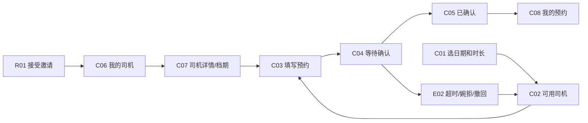
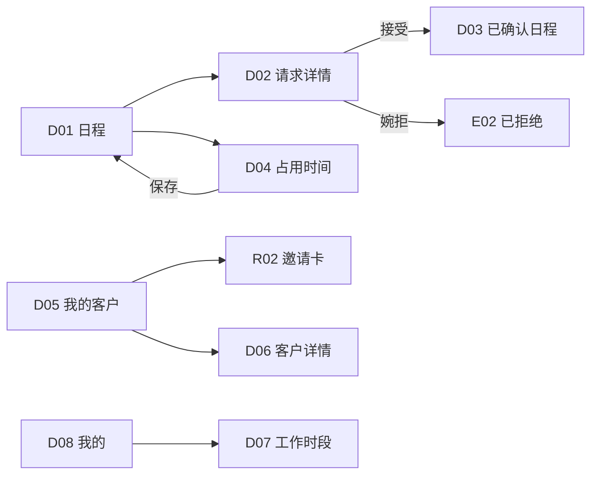

# 私驾约 · 交互与视觉设计方案

版本：v0.1 · 2026-09-13。配套《01-产品需求文档》。本文件描述目标设计，Stitch实际生成覆盖以交付记录为准。

## 1. 设计主张

让时间和熟悉的人成为界面主角。客户进入后先回答“什么时候用车”，司机进入后先看到“今天的安排和待确认请求”。文案短、动作明确，避免车图广告、价格刺激与平台派单语义。

视觉基调：暖白、森林绿、少量琥珀；轻量私人通讯录与日历工具。使用中文系统无衬线，数字有清晰层级。所有页面以390px手机视口设计，360—430px可适配；保留微信顶部胶囊及底部安全区。

## 2. 设计系统

| 项目 | 规范 |
|---|---|
| 页面背景 | #F7F8F5 |
| 卡片表面 | #FFFFFF |
| 主色 | #173F35，主要按钮、选中导航、核心强调 |
| 浅色辅助 | #E7EFE8，日期选中与次级区域 |
| 正文/次要文字 | #202925 / #626E67 |
| 分割线 | #DDE3DE，1px |
| 待确认 | #805514文字，#FFF2D9背景，时钟图标+中文状态 |
| 错误与取消 | #A43932，简短说明，不整页大红 |
| 字号 | 页面主标题28/34；二级20/28；正文16/24；辅助14/20；时间数字24—32 |
| 间距 | 4px基础单位；页面左右20；区块24；字段16；标签8 |
| 圆角 | 卡片16；输入12；主按钮14；状态标签小胶囊 |
| 按钮 | 主按钮48—52高，全宽；主要点击区域≥44×44 |
| 图标 | 20—24px一致线性风格；不用emoji充当核心操作图标 |
| 阴影 | 仅浮层必要时轻微使用；日程和列表以分割线组织 |

状态必须“图标+文字+颜色”；不可预约按钮禁用且有说明。弱化卡片仍保持文字可读。表单错误位于字段下方，不能只用toast。底部固定操作区不得遮挡最后一个字段。

## 3. 页面与组件清单

页面ID用作需求、原型与开发的对应键；同一页面的多个状态不需要多份业务代码。

| ID | 页面/状态 | 关键内容与动作 |
|---|---|---|
| C01 | 用车首页 | 日期/时间/时长/结束时间、查可约司机、最近预约、三个Tab |
| C02 | 可用司机 | 查询条件、关联司机三态、可约者选择、修改时间 |
| C03 | 发起预约 | 司机+时间摘要、地址/人数/联系人/备注、规则提示、提交 |
| C04 | 预约详情·待确认 | 对方姓名、截至时间与倒计时、尚未成功、联系/撤回 |
| C05 | 预约详情·已确认 | 已确认、行程与司机资料、联系、次级取消 |
| C06 | 我的司机 | 私人司机搜索、常用标记、司机详情入口 |
| C07 | 司机详情与档期 | 已授权资料、日期与忙闲、选择时间；不显示其他人行程 |
| C08 | 我的预约 | 待确认/待出行/历史，列表进入详情 |
| C09 | 我的/身份切换 | 本人资料、预约入口、消息、切换身份 |
| D01 | 日程·有待确认 | 日期条、待确认提示、时间轴、占用时间 |
| D02 | 预约请求详情 | 路线/人数/备注、截止时间、缓冲占用、接受/婉拒 |
| D03 | 日程·已确认 | D01的确认后状态；预约与前后缓冲区别显示 |
| D04 | 添加/编辑占用 | 起止日期与时间、原因、私有备注、保存/删除 |
| D05 | 我的客户 | 自有客户搜索、合作次数、邀请客户 |
| D06 | 客户详情 | 联系、已完成次数、历史预约、仅自己可见的备注 |
| D07 | 工作时段设置 | 每周开放时间、休息日、缓冲、暂停新预约 |
| D08 | 司机资料/我的 | 姓名、联系方式、车辆、可乘人数、身份切换 |
| R01 | 接受邀请 | 公开摘要、关系说明、添加到我的司机 |
| R02 | 司机邀请卡 | 单次邀请二维码、到期说明、保存/转发/撤销 |
| E01 | 暂无司机/无可约司机 | 邀请引导或修改时间，两个不同空状态 |
| E02 | 拒绝/超时/已撤回/取消 | 对应文案、回到自己的司机重新选择 |
| E03 | 表单校验/并发冲突 | 保留输入、字段错误、重新查询 |

主要复用组件：日期条、日期时间底部选择器、时长选项、司机条目、人物与车辆摘要、路线摘要、状态条、倒计时、预约卡片、日程时间轴、缓冲带、确认弹层、空状态、底部操作区、身份入口。

## 4. 客户预约流程

C01默认选下一个满足提前量的15分钟时刻；时长默认2小时。用户修改后明确显示预计结束日期/时间。无关联司机时用空态替代查询表单。

C02所有司机均来自自己的关系；“确认中”不可提交，不出现他人请求倒计时。所有司机不可约时提供修改时间，不假装有附近车辆。

C03点击“发起预约”后显示提交中并防重复；成功进入C04。冲突保留输入，提供“重新查看司机”。手机号原型只显示脱敏示例；真实校验交由开发实现。

C04显示“等待李师傅确认”“还未预约成功”“30分钟内未确认将自动结束”。点击撤回弹出确认，成功变更为E02。倒计时归零后重新向服务端获取状态；不由前端直接变更预约。

C05显示“李师傅已确认”，不用“支付成功”。取消是次级文字操作；弹层须指明该预约、后果、原因，并提示临近出行时联系对方。

## 5. 司机处理与日程流程

时间轴按真实时间比例或清晰时刻刻度呈现，不用等高卡片暗示不同长度行程相同。待确认为琥珀，已确认浅绿，手工占用灰色；前后缓冲使用浅灰斜纹与文字“缓冲”，不能与可用时间混淆。

D02接受时禁用重复操作；失败或过期保留详情并显示当前状态。成功提示“已确认预约”，通知发送结果未验证前不写“已通知客户”。司机拒绝可选简短原因，客户端默认显示“司机暂时无法接受这次预约”。

D04日期默认为当前查看日；默认一小时。输入开始和结束时刻（跨日明确显示结束日期），原因默认已有行程。隐私说明为“客人只会看到不可预约”。重叠已确认/待确认请求时明确显示司机自己可见的冲突项，不提供“强制覆盖”。

D07设置变更如影响已确认行程，提示保留既有预约；不生成自动取消动作。

## 6. 邀请、身份与隐私

客户和司机身份均属于同一个账户，但身份切换不等于跨账户授权。原型测试可用演示控制切换“张先生”和“李师傅”，该控制属于演示环境，不能出现在正式客户界面中。

R02是司机的发出邀请页面；R01是客户打开后的接受页面，必须分别设计，不能将“生成二维码”和“接受邀请”混在同一个用户任务里。

邀请尚未接受前只展示头像、姓名、车型、可乘人数。建立关系后司机详情可显示已授权联系方式。解除关系放在详情的更多菜单，采用二次确认，不做醒目的主按钮。

示例车辆为腾势D9、别克GL8、奔驰V级，可乘人数均为6人；必须写“可乘6人”，避免7座被当作可坐7名乘客。

## 7. 原型统一演示脚本

演示查询：2026年9月16日周三15:00—17:00，张先生，武汉天地→天河机场，2人，备注2个行李箱。司机李师傅，腾势D9，可乘6人。申请发起时间用原型模拟值，倒计时29:59，前后缓冲各30分钟。

1. R02生成邀请 → R01接受 → C06出现李师傅。
2. C01选时间 → C02李师傅可约、陈师傅确认中、王师傅不可约 → C03提交 → C04待确认。
3. 通过演示身份切换进入D01 → D02接受 → D03显示15—17已确认及14:30—15、17—17:30缓冲。
4. 回到客户C05显示已确认。页面切换是原型演示，不代表真实跨设备消息同步。
5. D04在9月17日10—13添加私人占用 → 日程显示占用；客户相同时间只见不可约。
6. 演示撤回、超时和全部不可约三个异常；任何失败均不能自动预约其他司机。

## 8. 原型评审标准

- 首页3秒能看懂核心用途，首屏能找到查询或占用时间。
- 普通客户能区分提交与确认；不能从客户界面操作司机接受。
- 已选择的日期、时间、司机、人数跨页保持一致。
- 所有三态司机都有清晰文字，确认中和不可约不能点击提交。
- 客户无他人名字、路线或占用原因；司机私有备注不外泄。
- 底部按钮可达、无遮挡、中文不溢出；次级页面有返回。
- 手机导航保持客户3Tab、司机3Tab，不引入桌面侧栏。
- 原型生成页面与文档出现差异时，文档业务规则优先；在交付记录明确列出待修项。

## 9. 实施交接

设计变量、页面ID和验收编号一起交付。研发逐项映射权限、状态与冲突逻辑，不从静态截图推断业务。Stitch产出的代码仅为视觉/原型材料，正式微信小程序适配、组件化、后端集成和实机测试另行实施。
